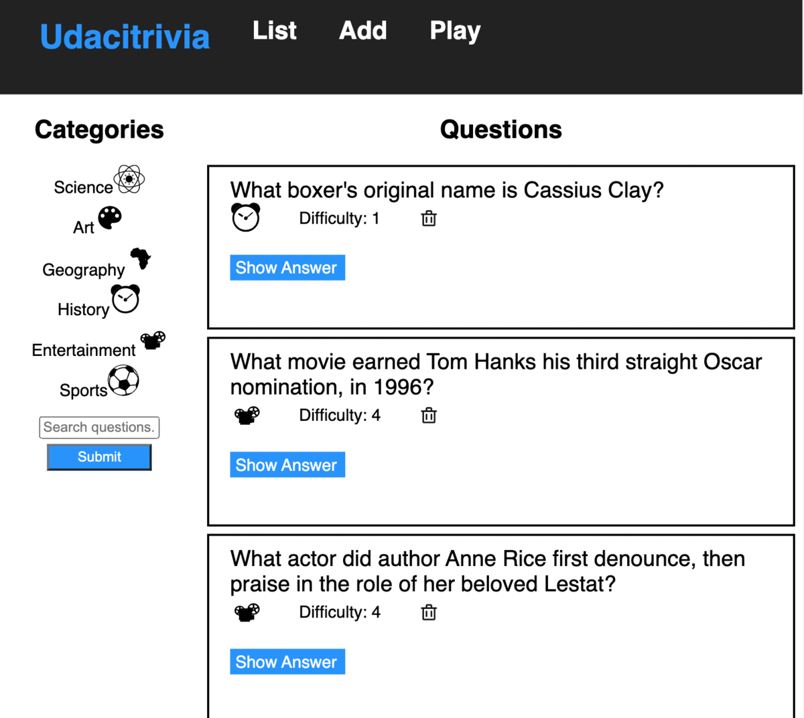

# TRIVIA APP

## Introduction 

This project is a Trivia game can be played alone or in a group of people to test their knowledge in different fields with questions of varying difficulties. The game allows a player or players to answer five(5) questions and scores a player accordingly at the end of the game.

The project has various technical topics included and concepts implemented to make the application work. The following are topic covered and concepts implemented in the application :
  - SQLAlchemy ORM
  - CORS (Cross Origin Resource Sharing )
  - TDD (Test Driven Development)
  - Pagination
  - Endpoints and Payloads
  - Project and API Documentation

This project is part of the requirements need to fulfill the attainment of the Alx-T Udacity Fullstack Nano Degree.
## Game Play 


## Getting Started

### Pre-requisites and Local Development
Developers using this project should already have the following installed on their local machines :
-   python/python3
-   pip/pip3
-   node
### Backend

#### Conventions and Best Practices 
- All backend code follows [PEP8 style guidelines](https://www.python.org/dev/peps/pep-0008/).

#### Setup
From the Trivia folder (main folder):
- run `cd backend` . This command takes you to the back end folder.
- run `pip install requirements.txt`. All required packages are included in the requirements file. 

Run the following commands to startup the application (ensure you are still in the **backend** directory) : 
```
export FLASK_APP=flaskr
export FLASK_ENV=development
flask run
```
The commands above puts the application in development and directs it to use the `__init__.py` file in our flaskr folder. Working in development mode shows an interactive debugger in the console and restarts the server whenever changes are made.

If running locally on Windows, look for the commands in the [Flask documentation](http://flask.pocoo.org/docs/1.0/tutorial/factory/).

By default the application runs on `http://127.0.0.1:5000/` and is a proxy in the frontend configuration. 

### Frontend

From the frontend folder, run the following commands to start the client: 
```
npm install // run once to install dependencies

npm start  // start front end server
```

By default, the frontend runs on `localhost:3000` 

### Tests
In order to run tests navigate to the backend folder (`commmand : cd backend`) and run the following commands: 

```
dropdb trivia_test
createdb trivia_test
psql trivia_test < trivia.psql
python test_flaskr.py
```

Omit the **dropdb** command if you are running test for the first time. 

All tests in the app are kept in the `test_flaskr.py` file and should be maintained as updates are made to app's functionalities. 

## API Reference

- Base URL

  The base url for accessing the API is `http://127.0.0.1:5000/`

- API Keys

  No Api keys needed to access the resources for this API
### Error Handling

The error messages and the error type  returned when requests fail are as follows :

| Status Code | Status  | 
| ----------- | ----------- |
| 400        | Bad request    |         
| 404        | Not Found    |         
| 405        | Method not allowed |
| 422        | Unprocessable entity |  
| 500        | Internal server error |

Errors are returned in the following JSON format :

```
{
'success': False,
'error': 404,
'message': 'Resource Not found'
}
```

### Endpoints 

#### GET /categories
- General:
    - This resource shows all categories available 
    - Returns categories object, total categories and success value.
- Sample: `curl http://127.0.0.1:5000/categories`

```
{
  "categories": {
    "1": "Science",
    "2": "Art",
    "3": "Geography",
    "4": "History",
    "5": "Entertainment",
    "6": "Sports"
  },
  "total_categories": 6
  "success": true,
}
```
#### GET /questions
- General:
    - This resource shows all questions available 
    - Returns categories object,current category,a list of question objects, success value, and total number of questions
    - Results are paginated in groups of 10. Include a request argument to choose page number, starting from 1. 
    - Include a request argument for page number, starting form 1. Code sample for request argument: `page = request.args.get("page", 1, type=int)`
- Sample: `curl http://127.0.0.1:5000/questions?page=1`

```
{     
    "current_category": "Geography",

    "categories": {
        "1": "Science",
        "2": "Art",
        "3": "Geography",
        "4": "History",
        "5": "Entertainment",
        "6": "Sports"
    },

    "questions": [
        {
        "answer": "Maya Angelou",
        "category": 4,
        "difficulty": 2,
        "id": 5,
        "question": "Whose autobiography is entitled 'I Know Why the Caged Bird Sings'?"
        },
        {
        "answer": "Muhammad Ali",
        "category": 4,
        "difficulty": 1,
        "id": 9,
        "question": "What boxer's original name is Cassius Clay?"
        },
        {
        "answer": "Apollo 13",
        "category": 5,
        "difficulty": 4,
        "id": 2,
        "question": "What movie earned Tom Hanks his third straight Oscar nomination, in 1996?"
        },
        {
        "answer": "Tom Cruise",
        "category": 5,
        "difficulty": 4,
        "id": 4,
        "question": "What actor did author Anne Rice first denounce, then praise in the role of her beloved Lestat?"
        },
        {
        "answer": "Edward Scissorhands",
        "category": 5,
        "difficulty": 3,
        "id": 6,
        "question": "What was the title of the 1990 fantasy directed by Tim Burton about a young man with multi-bladed appendages?"
        },
        {
        "answer": "Brazil",
        "category": 6,
        "difficulty": 3,
        "id": 10,
        "question": "Which is the only team to play in every soccer World Cup tournament?"
        },
        {
        "answer": "Uruguay",
        "category": 6,
        "difficulty": 4,
        "id": 11,
        "question": "Which country won the first ever soccer World Cup in 1930?"
        },
        {
        "answer": "George Washington Carver",
        "category": 4,
        "difficulty": 2,
        "id": 12,
        "question": "Who invented Peanut Butter?"
        },
        {
        "answer": "Lake Victoria",
        "category": 3,
        "difficulty": 2,
        "id": 13,
        "question": "What is the largest lake in Africa?"
        },
        {
        "answer": "The Palace of Versailles",
        "category": 3,
        "difficulty": 3,
        "id": 14,
        "question": "In which royal palace would you find the Hall of Mirrors?"
        }
    ],
    "total_questions": 20
    "success": true,
}
```

#### POST /questions
- General:
    - Creates a new question using the question, answer, category, and difficulty.
    - Returns a question to update the frontend and success value. 
  
- Sample: `curl http://127.0.0.1:5000/questions -X POST -H "Content-Type: application/json" -d '{"question":"Test Question", "answer":"Test Answer", "category": 1, "difficulty":4}'`
```
{
  "question": "Test Question", 
  "success": true
}
```

#### POST /questions
- Search:
    - Search questions by any phrase that is part of any question using the search term submitted in the request body.
    - Returns a list of question objects, success value, and total number of questions found in the search.
    - Request body : `{"searchTerm":"title"}`
- Sample: `curl http://127.0.0.1:5000/questions -X POST -H "Content-Type: application/json" -d '{"searchTerm":"title"}'`
```
{
  "questions": [
    {
      "answer": "Edward Scissorhands", 
      "category": 5, 
      "difficulty": 3, 
      "id": 6, 
      "question": "What was the title of the 1990 fantasy directed by Tim Burton about a young man with multi-bladed appendages?"
    }
  ], 
  "total_questions": 1,
  "success": true
}
```

#### DELETE /questions/{int:question_id}
- General:
    - Deletes the question of the given ID if it exists.
    - Returns the id of the deleted question, total books and success value. 
- Sample : `curl -X DELETE http://127.0.0.1:5000/questions/5`
```
{
  "deleted": 5, 
  "success": true, 
  "total_questions": 20
}
```
#### GET /categories/{int:category_id}/questions
- General:
    - This resource shows all questions available in a particular category.
    - It fetches questions based on a given category e.g questions under category with id=1.
    - Returns list of questions based on a given category, id of category, and success value.
- Sample: `curl http://127.0.0.1:5000/categories/1/questions`
```
{
  "category": "1", 
  "questions": [
    {
      "answer": "The Liver", 
      "category": 1, 
      "difficulty": 4, 
      "id": 20, 
      "question": "What is the heaviest organ in the human body?"
    }, 
    {
      "answer": "Alexander Fleming", 
      "category": 1, 
      "difficulty": 3, 
      "id": 21, 
      "question": "Who discovered penicillin?"
    }, 
    {
      "answer": "Blood", 
      "category": 1, 
      "difficulty": 4, 
      "id": 22, 
      "question": "Hematology is a branch of medicine involving the study of what?"
    }
  ], 
  "success": true
}
```

#### POST /quizzes
- General:
    - This resource fetches questions to allow a user play the game
    - Returns random questions within a given category,
    if provided, and that is not one of the previous questions.
    - Returns a random question to update the frontend and success value.
    - Request body : `{"previous_questions": [16,18], "quiz_category": {"id": 2}}`
  
- Sample: `curl http://127.0.0.1:5000/quizzes -X POST -H "Content-Type: application/json" -d '{"previous_questions": [16,18], "quiz_category": {"id": 2}}'`
```
{
  "question": {
    "answer": "Jackson Pollock", 
    "category": 2, 
    "difficulty": 2, 
    "id": 19, 
    "question": "Which American artist was a pioneer of Abstract Expressionism, and a leading exponent of action painting?"
  }, 
  "success": true
}
```
  
## Deployment N/A

## Authors
Yours truly, Marwan Mustapha Mai

## Acknowledgements 
- Allah the Almighty
- My family and friends
- Alx-T and Udacity team
- Worlako Dzokoto
- Fullstack Session Lead , Blessing Odede
- Career Session Lead , Russel Emekoba
- The Fullstack session members
- My collegues at work Ibrahim Isa and Dalhatu Njidda

## License
[License](./LICENSE.txt)
